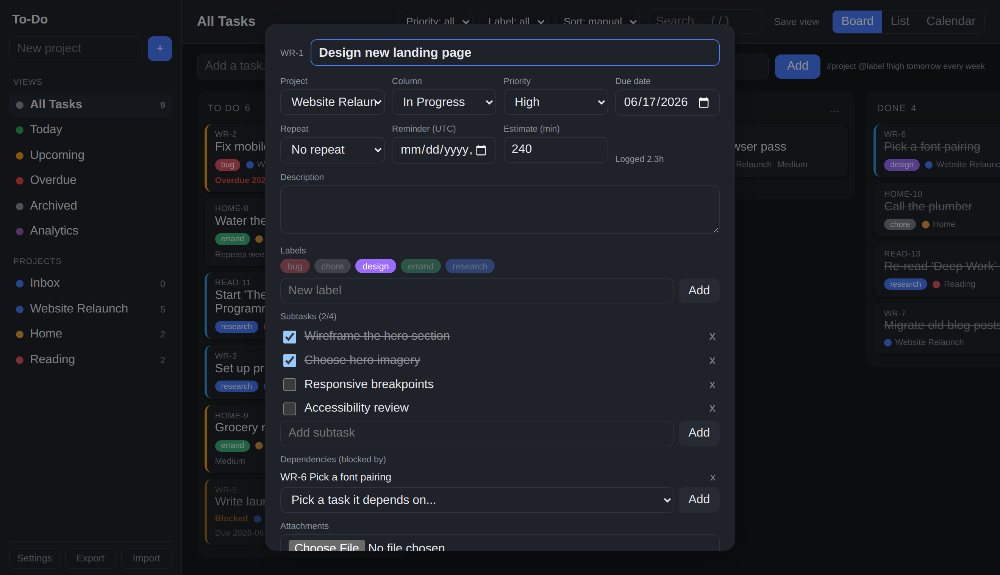
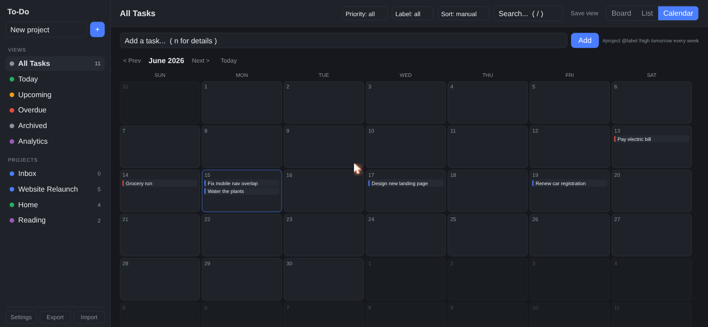
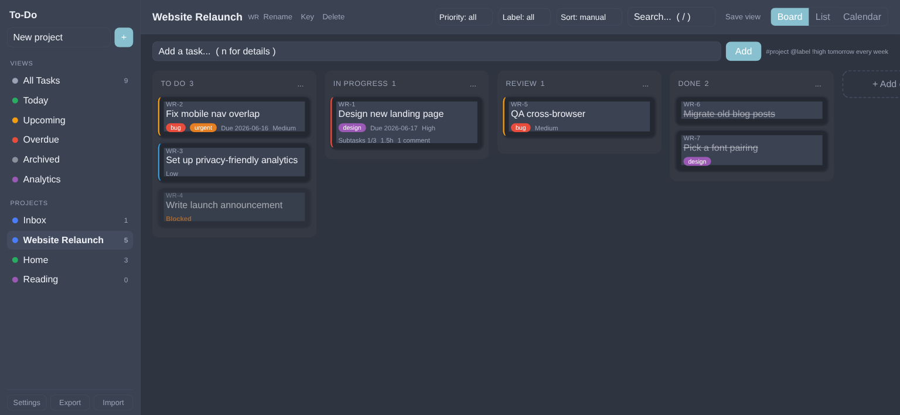
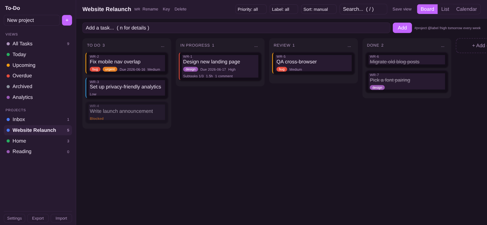

# To-Do Desktop

A cross-platform desktop client (Electron) for the self-hosted To-Do board. It
opens your board in a native window, **works offline**, and shows **native OS
reminder notifications**. Point it at your server's address and go.


> No server address is bundled — you enter it on first launch (e.g. `http://192.168.x.x:xxxx`).

---

## Why the desktop app

### 🔌 Works offline, syncs automatically
The full board is cached locally and served from the app itself, so it **opens and
works even when the server is unreachable**. Edits you make offline are queued and
**sync automatically** the moment the server is back — an indicator shows pending
changes.

### 🔔 Native reminder notifications
A background watcher checks your server for due reminders and pops a real **OS
notification** (click it to focus the window) — no browser tab required.

### 🎨 Themes & the full feature set
Everything the web app offers, in a native window: Kanban board, list, and
calendar; projects, labels, subtasks, comments, attachments, time tracking, task
dependencies, recurring tasks, analytics, and selectable **themes**.





A few of the built-in themes (Settings → Appearance):

| Light | Nord |
|:-----:|:----:|
|  |  |
| **Midnight** | **Grape** |
|  |  |

### 🪟 Native niceties
Remembers your window size and server URL, keeps you logged in, opens external
links in your browser, and has a real app icon in your taskbar.

---

## Install (Linux)

Download a file from the [Releases](../../releases) page:

| Format   | File                          | How to install |
|----------|-------------------------------|----------------|
| AppImage | `To-Do-*.AppImage`            | `chmod +x To-Do-*.AppImage` then run it. Works on any distro, no install needed. |
| Deb      | `todo-desktop_*_amd64.deb`    | `sudo apt install ./todo-desktop_*_amd64.deb` |

Prefer a **snap**? Build one in one command (see "Build it yourself") — snaps aren't
built in CI because snapcraft needs a desktop keyring that headless runners lack.

After installing, launch **To-Do** from your menu and enter your server's address.
On a phone, use the web app in your browser instead ("Add to Home Screen").

## Run from source

Requires [Node.js](https://nodejs.org) 18+.

```bash
npm install
npm start
```

## Build it yourself

```bash
npm run dist          # all Linux targets -> release/*.AppImage, *.deb, *.snap
npm run dist:appimage
npm run dist:snap
```

### Snap Store / Flathub
The release `.snap` installs directly (`sudo snap install --dangerous ./release/*.snap`).
Publishing to the **Snap Store** needs a free [snapcraft](https://snapcraft.io)
account (`snapcraft login` then `snapcraft upload`). For **Flathub**, build a
Flatpak (electron-builder's `flatpak` target) and submit a manifest to
[flathub/flathub](https://github.com/flathub/flathub) for review.

## Releases
Pushing a tag like `v1.0.0` triggers GitHub Actions to build the Linux installers
(AppImage + deb) and attach them to a GitHub Release automatically.

## License
MIT
